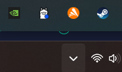

# Simple Chatbot With Ollama and Python
This is a simple chatbot with a simple interface that lets you talk to Monika from DDLC, or whatever character you like by changing the '.env'

**KEEP IN MIND THAT WINDOWS DON'T LIKE UNKNOWN APPS, BUT YOU CAN RUN IT WITHOUT PROBLEMS, IT SHOULDN'T HAVE ANY PROBLEMS WITH ANTIVIRUS AS FAR AS I KNOW (I USE AVAST)**

# Guide to installation
First we need Ollama, install it on the [official page](https://ollama.com/download)

Once you have ollama installed you need to download an AI model that the chat will use. Here you can customize your model and there are a lot of options that you can use. For more advanced users, you can check [Huggingface](https://huggingface.co) and check models compatible with Ollama.

I used Mistral, cause it worked well for me, and it has a quick installation with Ollama. Once you have it installed you can check if its running by checking the cute llama icon on the windows bar.

Open a terminal, if you are with Windows you can use search in the serch-nav of windows and type `cmd` and use command prompts from Windows. Now run in a terminal or commandline: `ollama run mistral` this will install the model that i have been using to test. If you want you can use other models from ollama, check the [official ollama doc](https://ollama.com/library?sort=popular) for other models, i haven't check them all.

This will install the [current Mistral](https://ollama.com/library/mistral) model of 7 billion parameters, which should run in many computers. 

**Keep in mind that IA takes a lot of resources so some old computers can't run it.**

Once installed run the executable and enjoy!

I installed a log in case that some error happened in `app.log`. Also I create a warning in case that ollama is running and you use it without problems.

# About the images
The chat have imatges, you can change them in the file call `.env` there the lines:

`CHAT_USER_ICON="media/user_icon.png"
CHAT_IA_ICON="media/ia_icon.png"`

So you can change the name of the files by editing the name of the `.png`

**KEEP IN MIND THAT THE `.png` MUST BE 30x30 OTHER WHISE IT WILL BREACK THE CHAT SIZE**

# About the template model
Okay so now comes the soul and mind of the model. in the `.env` file i write a **`TEMPLATE_FOR_MODEL`** here is where you can write the personality of the model. 

This is a quite complex topic that i don't fully understand. 
I go with a simple and reduce description, because it works for me and having less tokens (like words, for purpose of simplicity) I consider that it can make the model works better and use less CPU.

With that I invite you to test and experiment to find the best combination for you.

Remember to restart the application to see apply the changes.

# Future works
- Add a settings to modify the .env file
- Create a dinamic text Size
- improve the navigation of the text
- Add pre-made characters and make them save compatible
- implement a save conversation